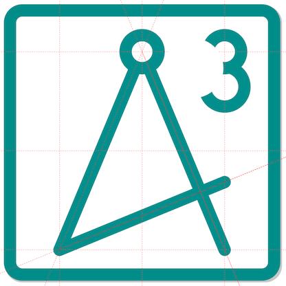

**A4cube**

    A4cube is an experimental all-electron DFT application.
    It is based on a various representations:
        real-space grids,
        plane waves and
        factorizable local orbitals.
    Furthermore, the Green functions formalism, near-sightedness
    for linear-scaling and the projector augmented wave method (PAW), 
    in particular the revised PAW methd (see Paul F. Baumeister and Shigeru Tsukamoto,
      proceedings of PASC'19, https://dl.acm.org/doi/10.1145/3324989.3325717)

**Name**
The name refers to a cube with edge length 1 Angstrom
which is abbreviated \AA in TeX code.
This is because always 4x4x4 real-space grid points are grouped
for performance which corresponds to roughly one \AA^3

**Principles**
The idea is to have a code that 
- is highly parallel
- can make use of GPUs
- does not require more input than the atomic coordinates
- can scale linearly

**Current Status**
- These features are planned but have so far not been addressed:
    - different versions of LDA, GGA, meta-GGA (currently only LDA implemented)
    - efficient eigensolver for the grid Hamiltonian (currently inefficient subspace rotation method)
    - MPI parallelization (currently none)
    - OpenMP parallelization (currently none)
    - GPU acceleration (currently none)
    - fancy boundary conditions (currently only periodic and isolated)
    - forces (currently none)
    - self-consistency convergence criteria (currently we set the number of iterations)
    - magnetism, collinear and non-collinear (currently none)
- These features are ready:
    - total energy
    - complex wave functions, ***k***-points
    - potential generation (currently only non-magnetic)
    - multigrid Poisson solver for the electrostatics (currently only serial)
    - SHO-projector PAW with all-electron atoms (currently only non-magnetic)
- Some features are build in only for development purposes:
    - a stable FFT Poisson solver for the electrostatic problem
    - plane wave basis set using a dense matrix eigensolver (LAPACK) or iterative (in development)
    - dense eigensolver for the real-space grid Hamiltonian
- These features are not intended to be implemented ever:
    - strain calculation
    - exact exchange
    - phonons

**Directories**
The root folder of this repository contains the following directories:
| Directory    | Purpose                                                                                |
|--------------|----------------------------------------------------------------------------------------|
| bin          | you can move your compiled executabales/libraries here but please do not git-add them  |
| data         | matrix element files for CHO and SHO transforms between radial and Cartesian bases     |
| doc          | documentation                                                                          |
| external     | put third party libraries here                                                         |
| green        | source folder for the Green function executable ./green                                |
| src          | source folder for the generator executabale ./a43                                      |
| include      | source folder for header files                                                         |
| julia        | experimental modules in the Julia programming language                                 |
| ref          | reference output of certain unit tests                                                 |
| test         | test scripts for certain modules                                                       |

**Abbreviations**
| Abbr.  | Explanation                                                                           |
|--------|---------------------------------------------------------------------------------------|
| DFT    | Density Functional Theory                                                             |
| LDA    | Local Density Approximation                                                           |
| GGA    | Generalized Gradient Approximation                                                    |
| PAW    | Projector Augmented Wave                                                              |
| CPU    | Central Processing Unit                                                               |
| GPU    | Graphical Processing Unit                                                             |
| SHO    | Spherical Harmonic Oscillator                                                         |
| CHO    | Circular Harmonic Oscillator                                                          |
| MPI    | Message Passing Interface                                                             |
| FFT    | Fast Fourier Transform                                                                |
| OpenMP | Open Multi-Processing                                                                 |
| TeX    | typesetting                                                                           |
