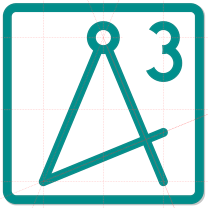

**AngstromCube**

[](https://github.com/real-space/AngstromCube)

    AngstromCube is an experimental all-electron Density Functional Theory (DFT) application.
    Using the Green functions (Gf) formalism, near-sightedness allows
    for linear-scaling and the Projector Augmented Wave (PAW) method, 
    in particular the revised PAW method, see Paul F. Baumeister and Shigeru Tsukamoto,
      [proceedings of PASC19](https://dl.acm.org/doi/10.1145/3324989.3325717)



**Setup**
```console
module --force purge
module load Stages/2025 imkl/2024.2.0 NVHPC/24.9-CUDA-12 CUDA/12 OpenMPI/5.0.5 CMake/3.30.3
rm -rf build
cmake . -B build -DHAS_MKL=ON -DHAS_MPI=ON -DHAS_FFTW=ON -DHAS_OPENMP=ON -DHAS_TFQMRGPU=ON
make -C build -j
```
Depending on your system of choice, you may need to switch some of these options to `OFF`.
On JSC systems (Jülich Supercomputing Centre) we can try it with the given module environment.


**Name**
The name refers to a cube with edge length 1 Angstrom which is abbreviated \AA in TeX code.
This is because always 4x4x4 real-space grid points are grouped for performance which corresponds to roughly one \AA^3

**Principles**
The idea is to have a DFT code that 
- is highly parallel and can make use of GPUs
- does not require more input than the atomic coordinates
- can scale linearly with the volume

**Current Status**
- These features are ready:
    - MPI parallelization of parallel_potential and tfQMRgpu Green function solver
    - total energy calculation
    - complex wave functions, complex Green functions, ***k***-points
    - boundary conditions for Wfs: periodic and isolated, for Gf also repeat and vacuum
    - non-magnetic potential generation
    - MPI parallel Poisson solver for the electrostatics (no preconditioner)
    - SHO-projector PAW with all-electron atoms (currently only non-magnetic)
    - GPU acceleration (CUDA support)
- These features are planned but have so far not been addressed:
    - different versions of LDA, GGA, meta-GGA (currently only LDA implemented)
    - efficient eigensolver for the grid Hamiltonian (currently inefficient subspace rotation method)
    - OpenMP parallelization (currently only in some places)
    - forces (currently none)
    - self-consistency convergence criteria (currently we set the number of iterations)
    - magnetism, collinear and non-collinear (currently only non-magnetic)
- Some features are build in only for development purposes:
    - a stable FFT Poisson solver for the electrostatic problem (serial only)
    - plane wave basis set using a dense matrix eigensolver (LAPACK) or iterative (in development)
    - dense eigensolver for the real-space grid Hamiltonian (expensive)
- These features are not intended to be implemented ever:
    - strain calculation
    - exact exchange
    - phonons

**Directories**
The root folder of this repository contains the following directories:
| Directory    | Purpose                                                                        |
|--------------|--------------------------------------------------------------------------------|
| src          | source folder for C++ and CUDA C++ sources                                     |
| include      | source folder for C and C++ header files                                       |
| doc          | documentation folder including manual and theory notes                         |
| doc/cho      | documentation and sources for the Circular Harmonic Oscillator (CHO) basis     |
| data         | matrix element files for SHO transforms between radial and Cartesian bases     |
| test         | test scripts for certain modules                                               |
| test/geo     | some atom geometries for input                                                 |
| external     | put third party libraries here                                                 |
| interfaces   | examples for the libliveatom.so library in C, Fortran90, Julia and Python      |
| tools        | experimental scripts in Julia and Rust (programming languages)                 |
| ref          | reference outputs of certain unit tests                                        |

**Abbreviations**
| Abbr. | Explanation                                                                           |
|-------|---------------------------------------------------------------------------------------|
| DFT   | Density Functional Theory                                                             |
| XC    | Exchange-correlation                                                                  |
| LDA   | Local Density Approximation                                                           |
| GGA   | Generalized Gradient Approximation                                                    |
| Wf    | Wave function (eigenstate)                                                            |
| Gf    | Green function                                                                        |
| PAW   | Projector Augmented Wave (method)                                                     |
| SHO   | Spherical Harmonic Oscillator                                                         |
| CPU   | Central Processing Unit                                                               |
| GPU   | Graphical Processing Unit                                                             |
| MPI   | Message Passing Interface                                                             |
| FFT   | Fast Fourier Transform                                                                |
| OMP   | OpenMP, Open Multi-Processing                                                         |
| TeX   | LaTeX typesetting                                                                     |
