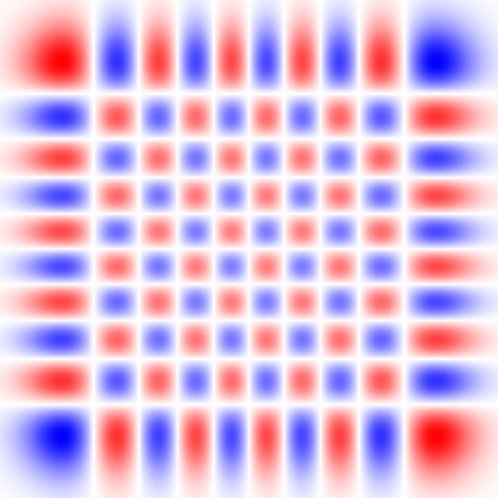
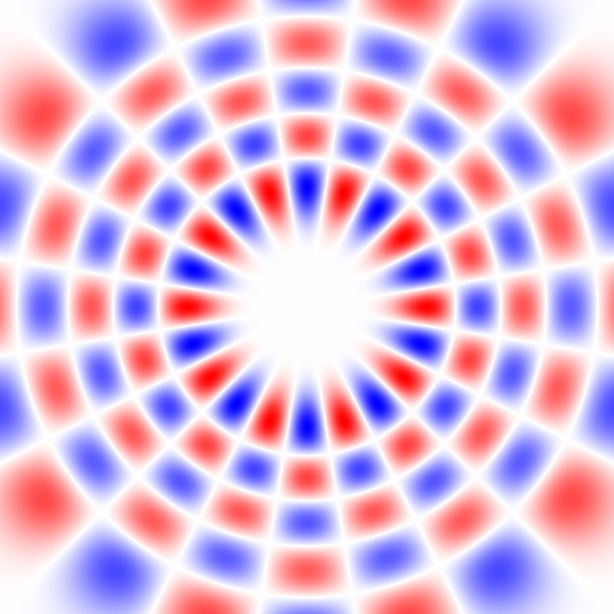

### Circular Harmonic Oscillator

Similar to the Spherical Harmonic Oscillator (SHO) 3D-basis used in A43
the Circular Harmonic Oscillator (CHO) basis is the 2D version.
There are two representations - the Cartesian factorizable representation and the radial representation:

## Cartesian representation of a nx=9 ny=9 Circular Harmonic Oscillator eigenstate

## Radial representation of a nr=4 m=10 Circular Harmonic Oscillator eigenstate

A unitary transformation allows to map between the two representations, see *cho_unitary.cxx* for the standalone generator code
and *cho_unitary.hxx* for a code that loads from *a43/data/cho_unitary.dat*.
While the Cartesian 1D-basis functions are a Gaussian times Hermite polynomials (like in SHO for 3D),
the radial functions of CHO are distinct from those in SHO, see *cho_radial.hxx* and *cho_plot_4panels.pdf*.
